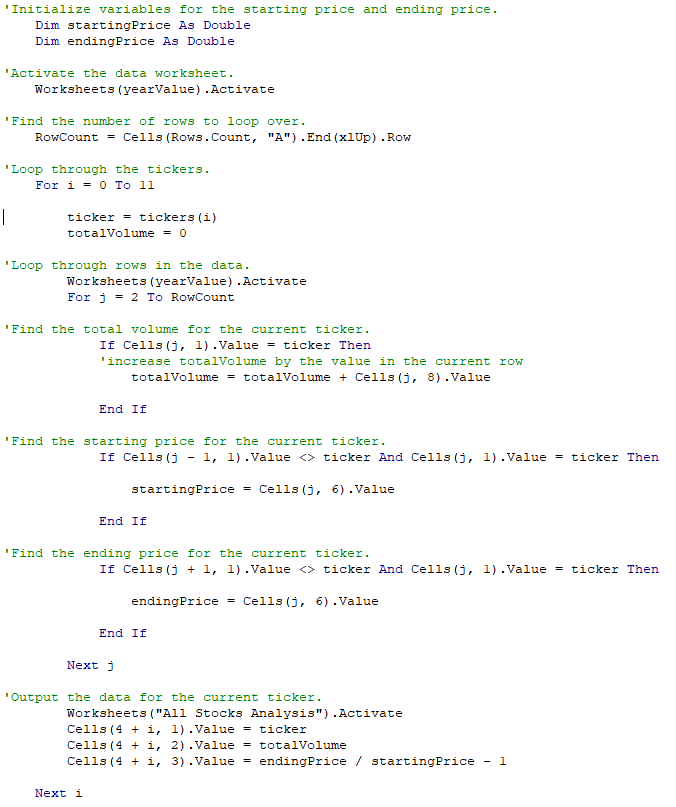

# Challenge-VBA-Stock

## Project Overview
The purpose of the analysis is to provide Steve the tools to help him analyze an entire dataset of stock tickers and to refactor the original script to allow for quicker analysis of the large datasets.

## Results
### 2017 v. 2018 Stock Performance
Based on the stock analysis for years 2017 and 2018, the results clearly show a downward trend on returns for most of the listed stocks as shown on figures 1 and 2. Only two stocks, ENPH and RUN, performed with positive returns from years 2017 and 2018. 

##### *Figure 1. 2017 Results*

##### *Figure 2. 2018 Results*

### Script Performance
Using the original script vs. the refactored script yielded the same results for both 2017 and 2018 data. The major difference between the two scripts was the execution time each script took. The original script executed with a time of 1.XXX seconds. The refactored script on the other hand took a significantly shorter time to execute with a time of .1xxx seconds. See figures 3 - 6. 

##### *Figure 3 & 4. 2017 Original Elasped Time & 2017 Refactored Elapsed Time*
 

##### *Figure 5 & 6. 2017 Original Elasped Time & 2017 Refactored Elapsed Time*
 

The attributing factors in the refactored script’s speed is the use of arrays and simply using one *For Loop* to run through the entire data set. To better explain the refactored script’s method, it is best to analyze where the two scripts diverge in working with the data. 
The original script shown in figure 7 utilized two *For Loops*. The inner *j* loop collected data in the volume column for the specified stock "AY", while running through the entire data set. The outer *i* loop changed to the next stock "CISQ" and once again ran though the *j* loop sequence. In essence, this script runs through the entire data set 12 times!

##### *Figure 7. Original Script*

The refactored script, meanwhile, does this differently. By utilizing *Arrays* and *If Statements* within a *For Loop* to differentiate when the stock ticker changes, as shown in figure 8, it was demonstrated that the refactored script ran through the data set only once with the same results. Original codes for both the original and refactored codes can be found here: [VBA_Challenge.xlsm](VBA_Challenge.xlsm)

##### *Figure 8. Refactored Script*

## Summary 
### 1.	What are the advantages or disadvantages of refactoring code?
### 2.	How do these pros and cons apply to refactoring the original VBA script?
Refactoring code is the process of restructuring existing code without changing its overall behavior. The many advantages of refactoring include reviewing the existing code for potential improvements in performance, structure, and design. But refactoring does have some disadvantages. For one, it takes time and resources to review, analyze, and execute new methods that may or may not improve performance or even be possible. In general, the advantages of refactoring outweigh the disadvantages as no code is perfect initially and can always be improved in one form or another. 

In our case, refactoring the original code was the correct decision. By just changing the method of which to run through the data set we were able to speed up the refactored script by an order of magnitude over the original script. Even though the run times for both scripts were quick, the data set was relatively small. If the data set where significantly larger then it becomes apparent that refactoring the code would be necessary. Although it did take some time to fully grasp and understand how this method was superior to the original, the decision the refactor was the correct choice as this led to a new way of thinking to better approach large data sets.
